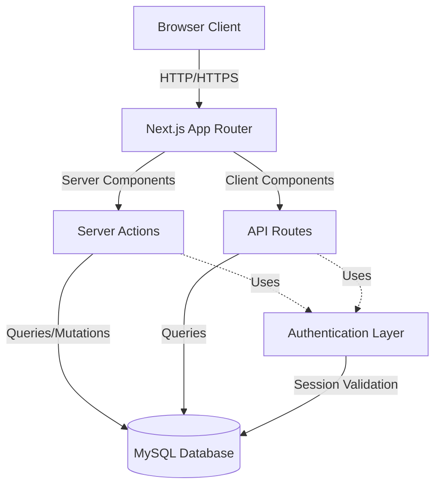

# Design Document: Restaurant Reservation System - Next.js Migration

## Overview

This design document specifies the architecture for migrating a Java Swing-based restaurant reservation system to a modern web application using Next.js 14+ with the App Router. The system manages table reservations, customer waitlists, ongoing reservations, and customer history for a restaurant with 15 tables of varying capacities (2, 4, 6, and 8 seats).

### Migration Goals

1. **Modernize Technology Stack**: Replace Java Swing desktop application with Next.js web application
2. **Maintain Feature Parity**: Preserve all existing functionality including real-time updates, table management, and reservation workflows
3. **Improve User Experience**: Implement responsive design, better visual feedback, and modern UI patterns
4. **Enhance Security**: Implement secure authentication with password hashing and session management
5. **Enable Accessibility**: Make the system accessible from any device with a web browser

### Key Design Principles

- **Server-First Architecture**: Leverage Next.js App Router and Server Components for security and performance
- **Real-Time Data**: Implement polling mechanism for automatic status updates (matching existing 2-second refresh)
- **Type Safety**: Use TypeScript throughout for compile-time error detection
- **Database Compatibility**: Maintain existing MySQL database schema for seamless migration
- **Progressive Enhancement**: Build core functionality server-side with client-side enhancements

## Architecture

### High-Level Architecture



### Technology Stack

**Frontend:**

- Next.js 14+ (App Router)
- React 18+
- TypeScript 5+
- Tailwind CSS 3+ (styling framework)
- Shadcn/ui or similar component library (optional, for consistent UI components)

**Backend:**

- Next.js API Routes (for polling endpoints)
- Next.js Server Actions (for mutations)
- mysql2 (MySQL client with connection pooling)

**Authentication:**

- iron-session or next-auth (session management)
- bcrypt (password hashing)

**Development:**

- ESLint + Prettier (code quality)
- Zod (runtime validation)

### Deployment Architecture

- **Hosting**: Vercel, AWS, or similar Node.js-compatible platform
- **Database**: Existing MySQL database (connection via environment variables)
- **Environment Variables**: Database credentials, session secrets, API keys

## Components and Interfaces

### 1. Authentication System

#### Components

**LoginPage** (`app/login/page.tsx`)

- Server Component rendering login form
- Handles form submission via Server Action
- Redirects to dashboard on successful authentication

**RegistrationPage** (`app/register/page.tsx`)

- Server Component rendering registration form
- Validates password complexity (8+ chars, uppercase, lowercase, number, special char)
- Checks username uniqueness via Server Action

**AuthService** (`lib/auth.ts`)

- `hashPassword(password: string): Promise<string>` - Hash password using bcrypt
- `verifyPassword(password: string, hash: string): Promise<boolean>` - Verify password
- `createSession(userId: string, userData: UserData): Promise<void>` - Create encrypted session
- `getSession(): Promise<Session | null>` - Retrieve current session
- `destroySession(): Promise<void>` - Clear session on logout

#### Data Flow

1. User submits credentials → Server Action validates → Query database
2. On success: Create session → Redirect to dashboard
3. On failure: Return error → Display to user

### 2. Dashboard and Navigation

#### Components

**DashboardLayout** (`app/dashboard/layout.tsx`)

- Server Component with authentication check
- Renders sidebar navigation
- Displays user name and current date/time
- Provides sign-out functionality

**Sidebar** (`components/Sidebar.tsx`)

- Client Component for interactive navigation
- Highlights active route
- Navigation items: Dashboard, Tables, Reservations, Waitlist, Ongoing, User Profile

**Header** (`components/Header.tsx`)

- Displays SERVOS branding
- Shows current user name
- Real-time clock display (client-side)
- Sign-out button

#### State Management

- Navigation state managed by Next.js App Router
- Active route determined by `usePathname()` hook
- User session data fetched server-side and passed to client components as props

### 3. Table Management and Visualization

#### Components

**TablesPage** (`app/dashboard/tables/page.tsx`)

- Server Component fetching current table states
- Renders 15 table buttons in floor plan layout
- Each table shows number and capacity

**TableButton** (`components/TableButton.tsx`)

- Client Component for individual table
- Visual states: Available (green), Occupied (red)
- Click handler opens table detail modal

**TableDetailModal** (`components/TableDetailModal.tsx`)

- Client Component showing table status
- For occupied tables: Display customer name, arrival time, departure time
- For available tables: Display availability message
- Close button returns to floor plan

#### Data Models

```typescript
interface Table {
  number: string; // "Table No. 1"
  capacity: number; // 2, 4, 6, or 8
  status: "available" | "occupied";
  reservation?: {
    firstName: string;
    lastName: string;
    arrivalTime: string;
    departureTime: string;
  };
}
```

#### Real-Time Updates

- Client-side polling every 2 seconds via API route
- API route queries database for tables with Status='Arrived'
- Updates table states in client component

### 4. Reservation Management

#### Components

**ReservationsPage** (`app/dashboard/reservations/page.tsx`)

- Server Component with initial data fetch
- Renders ReservationTable with Status='Pending' records
- Search functionality (client-side filtering)
- Delete button (moves to backup table)

**ReservationTable** (`components/ReservationTable.tsx`)

- Client Component with real-time polling
- Columns: ID, First Name, Last Name, Date, Arrival Time, Departure Time, Table Number, Contact Number, Status
- Status dropdown (Pending, Waiting, Arrived, Cancelled)
- Sortable columns
- Search filter

**StatusDropdown** (`components/StatusDropdown.tsx`)

- Client Component for status changes
- Validation rules:
  - Cancellation: Requires confirmation
  - Arrived: Only if current time >= arrival time AND date is today
  - Other changes: Only for today's reservations
- Calls Server Action on change

#### Server Actions

```typescript
// app/actions/reservations.ts
export async function updateReservationStatus(
  id: string,
  newStatus: ReservationStatus,
): Promise<Result<void>>;

export async function deleteReservation(id: string): Promise<Result<void>>;

export async function searchReservations(
  query: string,
): Promise<Result<Reservation[]>>;
```

#### Data Models

```typescript
type ReservationStatus =
  | "Pending"
  | "Waiting"
  | "Arrived"
  | "Completed"
  | "Cancelled";

interface Reservation {
  id: string;
  firstName: string;
  lastName: string;
  date: string; // YYYY-MM-DD
  arrivalTime: string; // HH:mm
  departureTime: string; // HH:mm
  tableNumber: string;
  contactNumber: string;
  status: ReservationStatus;
}
```

### 5. Waitlist Management

#### Components

**WaitlistPage** (`app/dashboard/waitlist/page.tsx`)

- Server Component with initial data fetch
- Renders WaitlistTable with Status='Waiting' records
- "Add Customer" button opens modal

**AddCustomerModal** (`components/AddCustomerModal.tsx`)

- Client Component with form
- Fields: First Name, Last Name, Date (default: today), Arrival Time (auto: current time), Departure Time, Table Number (dropdown with preview), Contact Number
- Table selection shows preview images and capacity
- Validates time ranges and operating hours (11:00 AM - 9:00 PM)
- Checks table availability via Server Action
- If available: Creates reservation with Status='Arrived'
- If unavailable: Creates reservation with Status='Waiting'

**TablePreviewCarousel** (`components/TablePreviewCarousel.tsx`)

- Client Component showing table images
- Displays seating capacity
- Two views per table (different angles)

#### Server Actions

```typescript
// app/actions/waitlist.ts
export async function checkTableAvailability(
  date: string,
  tableNumber: string,
  arrivalTime: string,
  departureTime: string,
): Promise<Result<boolean>>;

export async function addWaitlistCustomer(
  data: WaitlistCustomerData,
): Promise<Result<Reservation>>;
```

#### Validation Logic

Table availability check:

```sql
SELECT * FROM customer_reservation
WHERE Date = ? AND `Table Number` = ?
AND (
  (`Arrival Time` < ? AND `Departure Time` > ?) OR
  (`Arrival Time` < ? AND `Departure Time` > ?) OR
  (`Arrival Time` BETWEEN ? AND ?) OR
  (`Departure Time` BETWEEN ? AND ?)
)
```

If query returns rows, table is unavailable.

### 6. Ongoing Reservations

#### Components

**OngoingPage** (`app/dashboard/ongoing/page.tsx`)

- Server Component with initial data fetch
- Renders OngoingTable with Status='Arrived' records
- Real-time polling for updates

**OngoingTable** (`components/OngoingTable.tsx`)

- Client Component similar to ReservationTable
- Allows status changes
- Automatic status update to 'Completed' when departure time passes

#### Background Status Updates

Server-side cron job or API route called by polling:

```typescript
// app/api/cron/update-statuses/route.ts
export async function GET() {
  const now = new Date();
  const today = format(now, "yyyy-MM-dd");
  const currentTime = format(now, "HH:mm");

  // Update Arrived → Completed
  await db.execute(
    `UPDATE customer_reservation 
     SET Status = 'Completed' 
     WHERE Date = ? AND \`Departure Time\` <= ? AND Status = 'Arrived'`,
    [today, currentTime],
  );

  // Move Cancelled to backup
  await db.execute(
    `INSERT INTO backup SELECT * FROM customer_reservation WHERE Status = 'Cancelled'`,
  );
  await db.execute(
    `DELETE FROM customer_reservation WHERE Status = 'Cancelled'`,
  );

  return Response.json({ success: true });
}
```

### 7. Customer History

#### Components

**HistoryPage** (`app/dashboard/history/page.tsx`)

- Server Component with initial data fetch
- Renders HistoryTable with Status='Completed' records
- Search and sort functionality

**HistoryTable** (`components/HistoryTable.tsx`)

- Client Component (read-only)
- Same columns as ReservationTable
- No status editing

### 8. Deleted Reservations

#### Components

**DeletedPage** (`app/dashboard/deleted/page.tsx`)

- Server Component fetching from backup table
- Renders DeletedTable with cancelled reservations
- Restore button

**RestoreButton** (`components/RestoreButton.tsx`)

- Client Component
- Validates Status='Pending' before restore
- Calls Server Action to move from backup to main table

#### Server Actions

```typescript
// app/actions/deleted.ts
export async function restoreReservation(id: string): Promise<Result<void>>;
```

### 9. User Profile

#### Components

**ProfilePage** (`app/dashboard/profile/page.tsx`)

- Server Component displaying user information
- Fields: First Name, Last Name, Username, Role (System Administrator), Password (masked)
- Current date/time display

## Data Models

### Database Schema (Existing)

**Table: `user`**

```sql
CREATE TABLE user (
  Id INT AUTO_INCREMENT PRIMARY KEY,
  `First Name` VARCHAR(255) NOT NULL,
  `Last Name` VARCHAR(255) NOT NULL,
  Username VARCHAR(255) UNIQUE NOT NULL,
  Password VARCHAR(255) NOT NULL
);
```

**Table: `customer_reservation`**

```sql
CREATE TABLE customer_reservation (
  Id INT AUTO_INCREMENT PRIMARY KEY,
  Date DATE NOT NULL,
  `Arrival Time` TIME NOT NULL,
  `Departure Time` TIME NOT NULL,
  Firstname VARCHAR(255) NOT NULL,
  Lastname VARCHAR(255) NOT NULL,
  `Table Number` VARCHAR(50) NOT NULL,
  `Contact Number` VARCHAR(50) NOT NULL,
  Status ENUM('Pending', 'Waiting', 'Arrived', 'Completed', 'Cancelled') NOT NULL
);
```

**Table: `backup`**

```sql
CREATE TABLE backup (
  Id INT PRIMARY KEY,
  Date DATE NOT NULL,
  `Arrival Time` TIME NOT NULL,
  `Departure Time` TIME NOT NULL,
  Firstname VARCHAR(255) NOT NULL,
  Lastname VARCHAR(255) NOT NULL,
  `Table Number` VARCHAR(50) NOT NULL,
  `Contact Number` VARCHAR(50) NOT NULL,
  Status VARCHAR(50) NOT NULL
);
```

### TypeScript Interfaces

```typescript
// types/index.ts

export interface User {
  id: number;
  firstName: string;
  lastName: string;
  username: string;
  password: string; // hashed
}

export interface Session {
  userId: number;
  firstName: string;
  lastName: string;
  username: string;
}

export type ReservationStatus =
  | "Pending"
  | "Waiting"
  | "Arrived"
  | "Completed"
  | "Cancelled";

export interface Reservation {
  id: number;
  date: string; // YYYY-MM-DD
  arrivalTime: string; // HH:mm
  departureTime: string; // HH:mm
  firstName: string;
  lastName: string;
  tableNumber: string;
  contactNumber: string;
  status: ReservationStatus;
}

export interface TableInfo {
  number: string;
  capacity: number;
  status: "available" | "occupied";
  reservation?: {
    firstName: string;
    lastName: string;
    arrivalTime: string;
    departureTime: string;
  };
}

export interface WaitlistCustomerData {
  firstName: string;
  lastName: string;
  date: string;
  arrivalTime: string;
  departureTime: string;
  tableNumber: string;
  contactNumber: string;
}

export type Result<T> =
  | { success: true; data: T }
  | { success: false; error: string };
```

## Error Handling

### Error Categories

1. **Authentication Errors**
   - Invalid credentials
   - Session expired
   - Unauthorized access

2. **Validation Errors**
   - Empty required fields
   - Invalid time format
   - Time outside operating hours
   - Departure before arrival
   - Password complexity requirements

3. **Business Logic Errors**
   - Table unavailable
   - Status change not allowed
   - Username already exists

4. **Database Errors**
   - Connection failure
   - Query execution failure
   - Transaction rollback

### Error Handling Strategy

**Server Actions:**

```typescript
export async function updateReservationStatus(
  id: string,
  newStatus: ReservationStatus,
): Promise<Result<void>> {
  try {
    // Validation
    if (!id || !newStatus) {
      return { success: false, error: "Missing required fields" };
    }

    // Business logic checks
    const reservation = await getReservation(id);
    if (!reservation) {
      return { success: false, error: "Reservation not found" };
    }

    if (newStatus === "Arrived") {
      const now = new Date();
      const arrivalTime = parseTime(reservation.arrivalTime);
      if (now < arrivalTime) {
        return {
          success: false,
          error: "Cannot mark as arrived before arrival time",
        };
      }
    }

    // Database operation
    await db.execute(
      "UPDATE customer_reservation SET Status = ? WHERE Id = ?",
      [newStatus, id],
    );

    return { success: true, data: undefined };
  } catch (error) {
    console.error("Error updating reservation status:", error);
    return {
      success: false,
      error: "Failed to update reservation status",
    };
  }
}
```

**Client Components:**

```typescript
const handleStatusChange = async (id: string, newStatus: ReservationStatus) => {
  const result = await updateReservationStatus(id, newStatus);

  if (!result.success) {
    toast.error(result.error);
    return;
  }

  toast.success("Status updated successfully");
  // Refresh data
  await refreshReservations();
};
```

### User-Facing Error Messages

- **Authentication**: "Invalid username or password. Please try again."
- **Validation**: "Please enter a valid time in HH:mm format (e.g., 14:30)"
- **Business Logic**: "The selected table is not available for the specified time range"
- **Database**: "An error occurred while processing your request. Please try again."

## Testing Strategy

### Testing Approach

This feature is a migration of an existing system to a new technology stack. The primary testing focus is on:

1. **Integration Testing**: Verify that the Next.js application correctly interacts with the existing MySQL database
2. **End-to-End Testing**: Ensure all user workflows function correctly in the web interface
3. **Manual Testing**: Validate UI/UX, responsive design, and visual consistency
4. **Migration Validation**: Confirm feature parity with the existing Java application

### Why Property-Based Testing Is Not Applicable

Property-based testing (PBT) is **not appropriate** for this feature because:

1. **UI Rendering and Layout**: The majority of the system involves rendering React components, table layouts, and visual elements. PBT cannot validate visual design, responsiveness, or user experience.

2. **Infrastructure as Code**: Next.js configuration, API routes, and deployment setup are declarative configurations, not pure functions with testable properties.

3. **External Dependencies**: The system heavily relies on:
   - MySQL database interactions (I/O operations)
   - Session management (stateful operations)
   - Real-time polling (time-dependent behavior)
   - File system operations (image assets)

4. **Side-Effect Operations**: Most operations are side-effect-heavy:
   - Creating/updating database records
   - Managing user sessions
   - Sending HTTP responses
   - Displaying toast notifications

5. **Migration Nature**: This is a technology migration, not new algorithm development. The business logic already exists and is validated in the Java application.

### Testing Strategy

**Unit Tests** (Example-Based):

- Authentication functions (password hashing, session creation)
- Validation functions (time format, operating hours, password complexity)
- Data transformation utilities (date formatting, status mapping)
- Business logic helpers (table availability calculation)

**Integration Tests**:

- Database connection and query execution
- Server Actions with database operations
- API routes returning correct data
- Session management across requests

**End-to-End Tests** (Playwright or Cypress):

- User registration and login flow
- Creating a new reservation
- Updating reservation status
- Adding a customer to waitlist
- Viewing customer history
- Restoring a deleted reservation

**Manual Testing**:

- Visual design and layout on different screen sizes
- Table floor plan visualization
- Real-time updates (2-second polling)
- Form validation and error messages
- Navigation and routing
- Accessibility (keyboard navigation, screen readers)

**Migration Validation**:

- Feature checklist comparing Java app to Next.js app
- Data integrity verification (database records unchanged)
- Performance comparison (response times, load times)

### Test Coverage Goals

- **Unit Tests**: 80%+ coverage for utility functions and business logic
- **Integration Tests**: All Server Actions and API routes
- **E2E Tests**: All critical user workflows (login, create reservation, update status)
- **Manual Tests**: All UI components and responsive breakpoints

### Example Unit Tests

```typescript
// __tests__/lib/validation.test.ts
import {
  validateTimeFormat,
  validateOperatingHours,
  validatePasswordComplexity,
} from "@/lib/validation";

describe("validateTimeFormat", () => {
  it("should accept valid time format HH:mm", () => {
    expect(validateTimeFormat("14:30")).toBe(true);
    expect(validateTimeFormat("09:00")).toBe(true);
  });

  it("should reject invalid time formats", () => {
    expect(validateTimeFormat("2:30")).toBe(false);
    expect(validateTimeFormat("14:30:00")).toBe(false);
    expect(validateTimeFormat("25:00")).toBe(false);
  });
});

describe("validateOperatingHours", () => {
  it("should accept times within 11:00 AM - 9:00 PM", () => {
    expect(validateOperatingHours("11:00")).toBe(true);
    expect(validateOperatingHours("21:00")).toBe(true);
    expect(validateOperatingHours("15:30")).toBe(true);
  });

  it("should reject times outside operating hours", () => {
    expect(validateOperatingHours("10:59")).toBe(false);
    expect(validateOperatingHours("21:01")).toBe(false);
  });
});

describe("validatePasswordComplexity", () => {
  it("should accept passwords meeting all requirements", () => {
    expect(validatePasswordComplexity("Password123!")).toBe(true);
    expect(validatePasswordComplexity("Secure@Pass1")).toBe(true);
  });

  it("should reject passwords missing requirements", () => {
    expect(validatePasswordComplexity("password")).toBe(false); // no uppercase, number, special
    expect(validatePasswordComplexity("PASSWORD123!")).toBe(false); // no lowercase
    expect(validatePasswordComplexity("Password")).toBe(false); // no number, special
    expect(validatePasswordComplexity("Pass1!")).toBe(false); // too short
  });
});
```

### Example Integration Test

```typescript
// __tests__/actions/reservations.test.ts
import { updateReservationStatus } from "@/app/actions/reservations";
import { getTestDatabase } from "@/lib/test-utils";

describe("updateReservationStatus", () => {
  let db: TestDatabase;

  beforeEach(async () => {
    db = await getTestDatabase();
    await db.seed(); // Insert test data
  });

  afterEach(async () => {
    await db.cleanup();
  });

  it("should update reservation status successfully", async () => {
    const result = await updateReservationStatus("1", "Arrived");
    expect(result.success).toBe(true);

    const reservation = await db.query(
      "SELECT * FROM customer_reservation WHERE Id = 1",
    );
    expect(reservation.Status).toBe("Arrived");
  });

  it("should reject status change before arrival time", async () => {
    // Create reservation with future arrival time
    await db.insert("customer_reservation", {
      Date: "2025-12-31",
      "Arrival Time": "18:00",
      Status: "Pending",
    });

    const result = await updateReservationStatus("2", "Arrived");
    expect(result.success).toBe(false);
    expect(result.error).toContain("arrival time");
  });
});
```

## Appendix: Migration Checklist

### Pre-Migration

- [ ] Backup existing MySQL database
- [ ] Document current Java application behavior
- [ ] Set up Next.js project with TypeScript
- [ ] Configure database connection with environment variables
- [ ] Install required dependencies (mysql2, bcrypt, iron-session, etc.)

### Development Phase

- [ ] Implement authentication system (login, registration, session management)
- [ ] Implement dashboard layout and navigation
- [ ] Implement table visualization and floor plan
- [ ] Implement reservation management (list, search, update status, delete)
- [ ] Implement waitlist management (list, add customer, table availability check)
- [ ] Implement ongoing reservations (list, auto-update status)
- [ ] Implement customer history (list, search)
- [ ] Implement deleted reservations (list, restore)
- [ ] Implement user profile page
- [ ] Implement real-time polling (2-second refresh)
- [ ] Implement background status updates (cron job or API route)
- [ ] Add form validation and error handling
- [ ] Style with Tailwind CSS matching existing color scheme
- [ ] Add responsive design for mobile/tablet
- [ ] Migrate image assets (table previews, icons, logos)

### Testing Phase

- [ ] Write unit tests for validation and business logic
- [ ] Write integration tests for Server Actions and API routes
- [ ] Write E2E tests for critical workflows
- [ ] Perform manual testing on all features
- [ ] Test on different browsers (Chrome, Firefox, Safari, Edge)
- [ ] Test on different devices (desktop, tablet, mobile)
- [ ] Validate feature parity with Java application
- [ ] Performance testing (load times, polling overhead)

### Deployment Phase

- [ ] Set up production environment (Vercel, AWS, etc.)
- [ ] Configure environment variables for production
- [ ] Set up database connection pooling
- [ ] Enable HTTPS/SSL
- [ ] Configure session security (secure cookies, CSRF protection)
- [ ] Set up monitoring and logging
- [ ] Deploy to production
- [ ] Smoke test all features in production
- [ ] Train users on new web interface

### Post-Migration

- [ ] Monitor for errors and performance issues
- [ ] Gather user feedback
- [ ] Address any bugs or usability issues
- [ ] Document new system for future maintenance
- [ ] Decommission Java application (after validation period)
